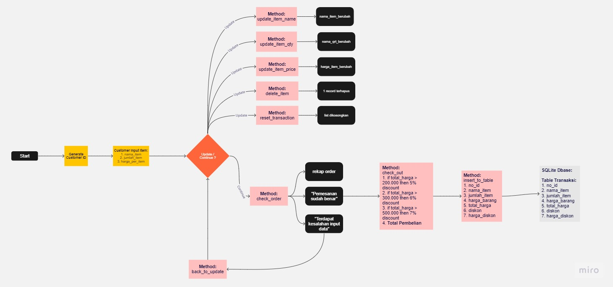
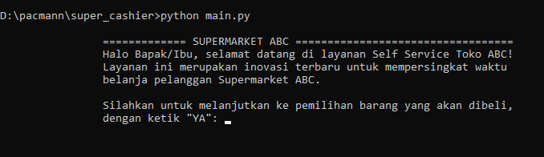

<head>
    <h1><b>Python Project: Self-Service Supermarket Management System</b></h1>
<head/>

<body>
    <ul>
        <li>
        <h2>Background</h2>
            

            A large supermarket owner in Jakarta finds out a strategy for 
            scalling up the business without location boundaries.  The owner wants to implement self-service system that can help customers from any cities across Indonesia can order the item from the store.
            

            

            Self-Service Supermarket Management System is a solution to store customers orders remotely from any location in Indonesia. This system has several capabilities. For instance, adding order information to a shopping cart, 
            reading the summary of an order, calculating discounts, changing the order information(item name, order quantity, item price), reset the shopping cartkeeping and also stores the final order to a database.
            

        </li>
        <li>
        <h2>System Flowchart</h2>
        

        
        <figcaption align="center"><i>Self-Service Supermarket Management System Flowchart</i></figcaption>
         
        
<b>
        This is the workflow of the system:
        </b>

            <ol>
                <li>Customer confirm to start the program.</li>
                <li>System will automaticaly generate random customer ID.</li>
                <li>Customer input the order data into the system includes item name, order quantity, item price, and city(additional).</li>
                <li>Automatically program will transform the input into suitable data structures that can be processed for the next step. If the data structure is not suitable, program will immediately throw an error and reshow the input order data menu.</li>
                <li>Customers input additional orders into the cart until they immediately confirm to stop adding order items.</li>
                <li>Customers immediately ask to confirm if there any changes or deletes they want to implement in their cart using several methods. Those are:
                <ol>
                    <li>Updating or changing item names.</li>
                    <li>Updating or changing order quantity for certain item.</li>
                    <li>Updating or changing price of an item.</li>
                    <li>Dropping or deleting an item from the cart.</li>
                    <li>Reset/clear cart.</li>
                    <li>Reapply adding order item menu(additional method).</li>
                </ol>
                </li>
                <li>If the customers done implementing the updates, then the system immediately will show the summary of the cart including total shopping amount, discount percentage, discount price, and total payments need to be paid.</li>
                <li>The system then immediately injects data into SQLite database using python API Injection.</li>
            </ol>
        

        </li>
        <li>
        <h2>Tools</h2>
            <ul>
                <li><h3>Languages</h3></li>
                    <ul>
                        <li>Python</li>
                        <li>SQLite</li>
                    </ul>
                <li><h3>Libraries</h3></li>
                    <ul>
                        <li>time</li>
                        <li>random</li>
                        <li>numpy</li>
                        <li>pandas</li>
                        <li>csv</li>
                        <li>sqlalchemy</li>
                    </ul>
            </ul>
        </li>
        <li>
        <h2>Feature Requirements</h2>
            <ul>
                <li>Customer generating transaction id with transaction method.</li>
                <li>Customer add order item with add_item([item name, item qty, item price]) method.</li>
                <li>Customer update item with these methods:
                    <ul>
                        <li>update_item_name(item_name, new_item_name)</li>
                        <li>update_item_qty(item_qty, new_item_qty)</li>
                        <li>update_item_price(item_name, new_item_price)</li>  
                    </ul>
                </li>
                <li>Customer can delete item with these methods:
                    <ul>
                        <li>delete_item(item_name), that will result:
                        
                        </li>
                        <li>reset transaction that will delete all the item order from the cart</li>
                    </ul>   
                </li>
                <li>Customer can check the if there any mistaken order using check_order() that will throw an error if there's any input error or notice the customer if the orders are already correct. In additional, this method will show the summary of customer order</li>
                <li>
                Customer will get noticed with total payments they need to pay using check_out method. This method will also identify which one of three discounts below that will be applied to customers order:
                    <ul>
                        <li>
                        If total amount per item above 200,000 rupiahs they will rewarded with 5% discount.
                        </li>
                        <li>
                        If total amount per item above 300,000 rupiahs they will rewarded with 6% discount.
                        </li>
                        <li>
                        If total amount per item above 500,000 rupiahs they will rewarded with 7% discount.
                        </li>
                    </ul>
                The overall total payments (in a cart) will not be injected to SQLite database.
                </li>
                <li>
                Whenever the check_out() method applied, the system will automaticaly inject the order data to sqlite database using insert_to_table(source_data). The table should contain these fields:
                    <ol>
                        <li>transaction_id (autoincrement)</li>
                        <li>item_name</li>
                        <li>order_quantity</li>
                        <li>item_price</li>
                        <li>total_amount : ammount per order item (per row)</li>
                        <li>discount : discount per order item (per row)</li>
                        <li>discount_amount</li>
                        <li>total_amount_after_discount</li>
                    </ol>
                </li>
                <li>
                Based on this requirements, there would be some modification in these requirements and flows that myself consider to be more efficient and intuitive for the customers.</li>
            </ul>
        </li>
        <li>
        <h2>Objective</h2>
            <ul>
                <li><b>Learning Objectives</b>
                    <ol>
                        <li>Creating Self-Service Management System with required features using Python.</li>
                        <li>Connecting python program to sqlite database.</li>
                        <li>Using OOP to create python program.</li>
                        <li>Using try and except in python flow control.</li>
                        <li>Using PEP8 principles to write clean python program.</li>
                        <li>Implemeting modular code in a program.</li>
                        <li>Adding docstring in each of class and function.</li>
                    </ol>
                </li>
                <li><b>Program Objectives</b>
                    <ol>
                        <li>Adding new unique transaction id on each transaction session.</li>
                        <li>Adding new order item in a cart once in a time.</li>
                        <li>Convert input immediately to valid data structure (throughout the program we will use dictionary and list).</li>
                        <li>Updating/changing/deleting the order item if customers need it.</li>
                        <li>Displaying the cart summary of the customer order with calculated discount and total payments after discount.</li>
                        <li>Injecting the final order item to a database.</li>
                    </ol>
                </li>
            </ul>
        </li>
        <li>
        <h2>Program Structure Description</h2>
        <ul>
            <li>
            <h3>Database Design</h3>
                <ul>
                    <li>
                    Step 1: Create database data_super_cashier.db
                    </li>
                    <li>
                    Step 2: Identifying fields that need to exist in table database.Image can be seen below:
                    
                    </li>
                    Output: data_super_cashier.db
                    </li>
                </ul>
            </li>
            <li>
            <h3>Method and Object Design</h3>
                <ul>
                    <li>
                    Step 1: Identifying modules, class and functions needed to establish the customer journey.
                    </li>
                    <li>
                    Step 2: Build modules based on their functionalities and each of the modules have classes and functions that supports those functions, classes and function list can seen below
                    </li>
                    </li>
                    Step 3: Establish connection with SQLite database by built an table manipulation modules.
                    </li>
                    <li>
                    Step 4: Import the modules in main.py,
                    </li>
                </ul>
            
            </li>
        </ul>
        </li>
        <li>
        <h2>Guide to Try It Yourself</h2>
            <ol>
                <li>Clone/download this git repository into your local computer. It should contain:
                    
                </li>
                <li>Open terminal > go to git repository directory or any file location where you download the files on your local computer, then type "python main.py" on your command line to execute. Refer to screenshot below:
                    
                </li>
            </ol>
        </li>
        <li>
        <h2>Test Case</h2>
            <ol>
                <li><h3>Add order item</h3></li>
                <li><h3>Delete item</h3></li>
                <li><h3>Reset Transaction</h3></li>
                <li><h3>Checkout</h3></li>
            </ol>
        </li>
        <li>
        <h2>Conlusion</h2>
            <ol>
                <li>
                For further improvement, this system need more comprehensive tables and RDBMS that could contain data beyond transactions like customers data, item stocks so the system can work on full scope and functionality.
                </li>
                <li>
                We might need to implement this system to web based applications with better UI and UX instead of only using Command Line Interface.
                </li>
                <li></li>
            </ol>
        </li>

<footer>
    <b>Author</b>
    Copyright (c) <i>2023 Andika Darmawan</i>
</footer>